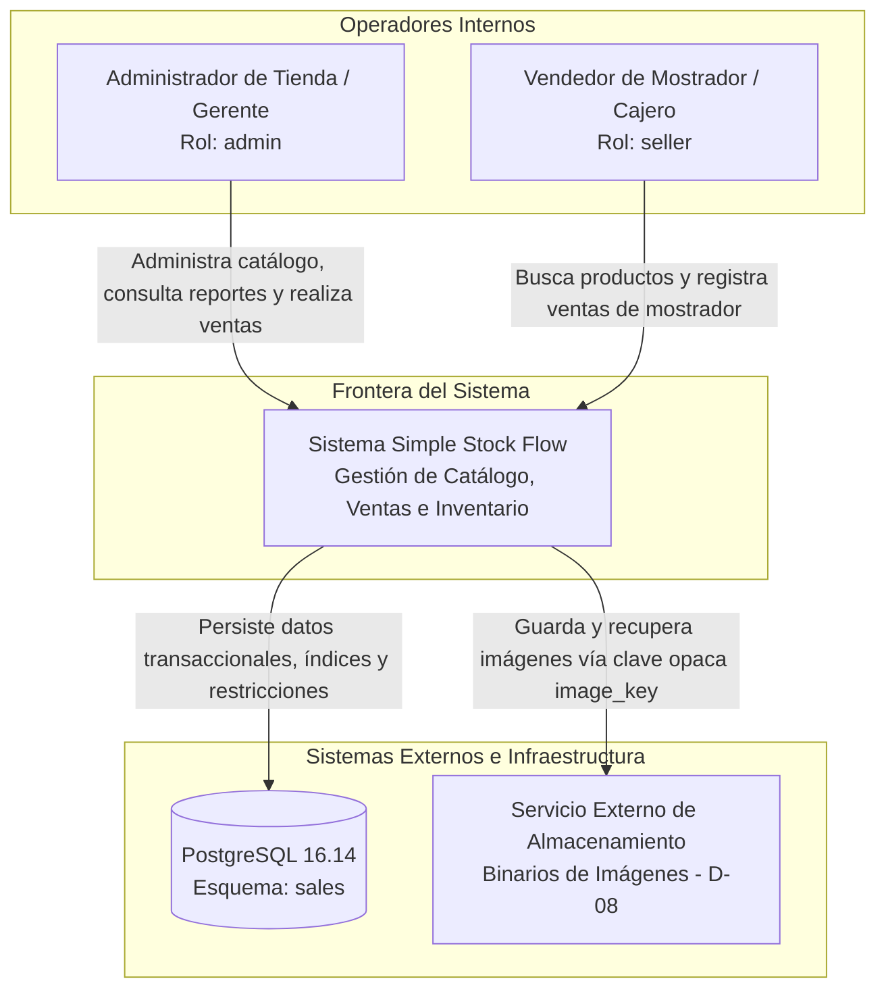

# 01 - Contexto del Sistema y Alcance (Simple Stock Flow)

> **Documento SDD · Fase 5 (Carpeta `01-context`)**  
> **Insumo:** `spec/data-model.md`  
> **Estado:** Descripción General, Diagrama de Contexto y Declaración de Alcance (In-Scope / Out-of-Scope)  

---

## 1. Descripción General del Sistema

**Simple Stock Flow** es un sistema transaccional de punto de venta (POS) y control de flujo de inventario diseñado para comercios minoristas de suministros técnicos (ferreterías, repuestos, materiales). 

El sistema permite a operadores internos autenticados gestionar un catálogo esencial de artículos, mantener existencias de bodega actualizadas en tiempo real, despachar transacciones de venta en mostrador de forma atómica y auditar el desempeño comercial mediante reportes históricos consolidados de alta fidelidad (`§1`, `§2`, `§6.1`).

---

## 2. Diagrama de Contexto del Sistema (C4 - Nivel 1)

### Actores del Sistema (`§1`, `§2.5`, `§7`)
* **Administrador (`admin`):** Responsable de la gestión del catálogo (creación, cambio de precio, baja lógica), reposición de inventario, consulta de reportes agregados y provisión de cuentas de vendedores (`DP-04`, `§11.1`).
* **Vendedor (`seller`):** Operador de caja que consulta productos en tiempo real, verifica existencias y confirma ventas en el mostrador.
* **Nota sobre clientes finales (`§1`, `§7`, `§12`):** **No existe la figura ni entidad de cliente/comprador**. La interacción con el sistema es 100% realizada por personal interno autenticado.

---

## 3. Declaración de Alcance: Qué se Construye (In-Scope)

El alcance del sistema está estrictamente delimitado por las 5 tablas físicas, 22 columnas, 8 restricciones y patrones de consulta del modelo de datos (`§2`, `§3`, `§4`, `§6.1`):

1. **Gestión de Catálogo de Productos (`§2.2`, `§3`, `DP-03`):**
   - Altas y modificaciones de productos con exactamente 5 atributos de negocio: `name`, `price`, `stock`, `category_id` e `image_key` opcional (`DP-03`).
   - Baja lógica mediante propiedad sombra `deleted_at` (`T-09`, `ADR-003`).
   - Control de inventario en tiempo real con impedimento absoluto de saldo negativo (`ck_product_stock_non_negative`, `ADR-002`).
   - Control de concurrencia optimista vía `xmin` (`D-04`, `T-10`).
2. **Catálogo de Categorías Sembradas (`§2.1`, `§9.1`, `D-10`):**
   - Conjunto cerrado y precargado de 5 categorías de solo lectura: *General, Herramientas, Electricidad, Fontanería y Pinturas*.
3. **Registro Atómico e Inmutable de Ventas (`§2.3`, `§2.4`, `§7.1`):**
   - Registro en mostrador con al menos una línea de venta (`Sale.EnsureConfirmable`).
   - Descuento indivisible y simultáneo de stock en el momento de la confirmación (`Sale.AddItem` -> `Product.Withdraw`).
   - Retención indefinida y permanente; las ventas no admiten edición ni borrado posterior (`§7.1`).
   - Congelamiento inmutable de precios, nombres de producto y categorías en cada línea de venta (`D-06`, `T-11`, `ADR-004`).
4. **Reporte Consolidado de Ventas (`§1`, `§6.1 Q9`, `D-06`, `ADR-004`, `§11.1`):**
   - Consulta agrupada por producto y categoría congelada en una ventana de fechas (`inicio <= fin`).
   - Ejecución delegada directamente al motor de base de datos para máxima eficiencia (`D-06`).
5. **Seguridad y Control de Operadores (`§2.5`, `§7`, `§9.2`, `D-09`):**
   - Autenticación con nombres de usuario normalizados (`User.NormalizeUsername`) y contraseñas irreversiblemente hasheadas (`password_hash`).
   - Conjunto cerrado de roles `admin` y `seller`.

---

## 4. Declaración de Límites: Qué NO se Construye (Out-of-Scope)

Para garantizar la máxima integridad del software y respetar las decisiones firmadas del proyecto (`§8`, `§12`), los siguientes aspectos quedan **explícitamente fuera del alcance**:

| Elemento Excluido | Justificación Técnica y Trazabilidad al Modelo |
|---|---|
| **Columnas de auditoría `created_at` / `updated_at`** | **Decisión cerrada de arquitectura (`§8`):** El sistema **NO** lleva columnas genéricas de auditoría ni disparadores `BEFORE UPDATE`. El único instante de negocio es `sale.sold_at` y el de transición es `product.deleted_at` (`§8`). |
| **Múltiples Monedas o Conversión de Divisas** | **Monomoneda por construcción (`D-05`, `§1`, `§3`, `§12`):** No existe columna de moneda en ninguna tabla. |
| **Atributos de producto adicionales** | **DP-03 (`§1`, `§12`):** Se excluyen descripciones largas, códigos de barras alternativos, variantes de producto y SKUs secundarios. |
| **Desglose de reportes por vendedor** | **DP-02 (`§6.3`, `§7`, `§12`):** No se generan métricas individuales de vendedores por motivos de protección de datos personales y clima laboral. |
| **Gestión y Perfilamiento de Clientes (CRM)** | **§1, §7:** No se registran datos personales de compradores, cuentas corrientes, historiales de cliente ni facturación nominativa B2C. |
| **Pasarelas de Pago Electrónico o Tarjetas** | **§7, §7.1:** El sistema asume liquidación directa de caja; no almacena tarjetas, tokens de pago ni procesa pasarelas bancarias. |
| **Plataforma de Comercio Electrónico (E-commerce)** | **§12:** No contempla carritos web persistentes, compradores externos ni registro público anónimo en internet. |
| **Mantenimiento dinámico de categorías (CRUD)** | **§2.1, §4.1, D-10:** Las categorías son de solo lectura y provienen de la semilla de base de datos. No hay interfaz de creación o borrado. |

---

## 5. Supuestos de Contexto Declarados

| Identificador | Supuesto de Contexto | Justificación |
|---|---|---|
| **SUP-CTX-01** | La solución opera en una red local o privada accesible solo por las terminales del comercio. | Dado que los usuarios son únicamente operadores internos (`admin` y `seller`) y no clientes externos de internet (`§1`). |
| **SUP-CTX-02** | Los comprobantes físicos de venta se generan e imprimen a partir de los datos retornados por el caso de uso `RegisterSale`. | El modelo almacena todos los hechos comerciales congelados indispensables para armar la tira de caja o factura (`§2.4`). |
