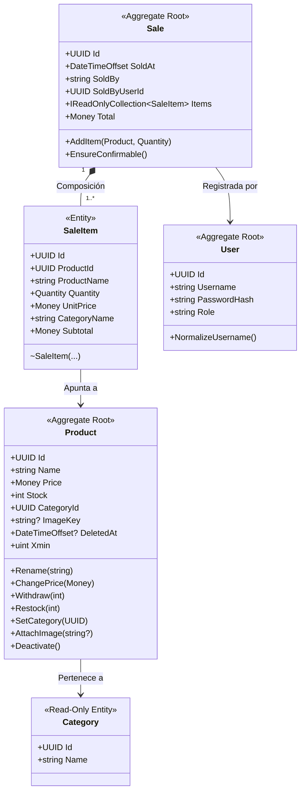
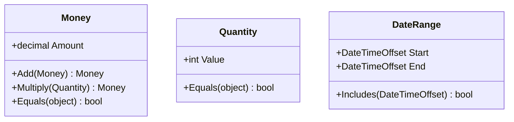
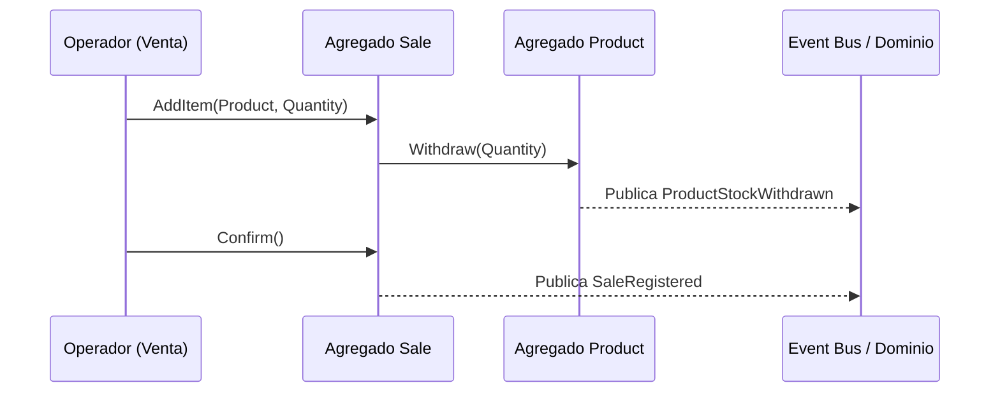

# 02 - Modelo de Dominio (Simple Stock Flow)

> **Documento SDD · Fase 4 (Carpeta `02-domain`)**  
> **Insumo:** `spec/data-model.md`  
> **Estado:** Glosario Ubicuo, Entidades, Objetos de Valor, Invariantes y Eventos de Dominio  

---

## 1. Glosario del Lenguaje Ubicuo (Ubiquitous Language)

Términos oficiales del negocio derivados estrictamente de `§1` y las decisiones estructurales:

| Término (Negocio) | Definición Funcional en el Dominio | Representación Técnica (`§1`) |
|---|---|---|
| **Producto** | Artículo comercializable del catálogo. Posee **nombre, precio, stock, categoría e imagen opcional, y nada más** (`DP-03`). | Entidad `Product` · Tabla `product` |
| **Categoría** | Clasificación a la que pertenece un producto. Conjunto **fijo de cinco categorías sembradas**, de solo lectura y sin mantenimiento en caliente (`D-10`, `§9.1`). | Entidad `Category` · Tabla `category` |
| **Precio** | Valor monetario vigente del producto para nuevas ventas. Debe ser estrictamente positivo (`price > 0`). | Value Object `Money` · Columna `product.price` |
| **Stock** | Unidades físicas disponibles para la venta. Nunca puede ser negativo (`stock >= 0`). | Atributo entero · Columna `product.stock` |
| **Imagen del producto** | Identificador externo del archivo gráfico asociado. Es una **clave opaca**, nunca la ruta ni el binario (`D-08`). Si está ausente se representa con `NULL`. | Atributo `image_key` · Columna `product.image_key` |
| **Venta** | Hecho comercial consumado e **inmutable**: quién, cuándo y qué se vendió. Una vez registrada no se edita ni se borra. | Raíz de agregado `Sale` · Tabla `sale` |
| **Línea de venta** | Renglón de la venta que relaciona producto, cantidad y **valores congelados** del momento. No existe fuera de su venta. | Entidad interna `SaleItem` · Tabla `sale_item` |
| **Cantidad** | Unidades vendidas en una línea. Número entero estrictamente positivo (`quantity > 0`). | Value Object `Quantity` · Columna `sale_item.quantity` |
| **Total de la venta** | Suma total de los subtotales de las líneas. **Se calcula en tiempo de ejecución, no se almacena en base de datos** (`§1`, Art. VII). | Propiedad calculada `Sale.Total` · Sin columna |
| **Subtotal de la línea**| Multiplicación de precio unitario congelado por cantidad. **Se calcula, no se almacena**. | Propiedad calculada `SaleItem.Subtotal` · Sin columna |
| **Usuario** | Operador interno autenticado que despacha y registra ventas. **No existe entidad cliente ni comprador** (`§1`, `§7`). | Raíz de agregado `User` · Tabla `user` |
| **Rol** | Permisos del operador dentro de un conjunto cerrado de dos: `admin` o `seller`. | Atributo `role` · Columna `user.role` |
| **Hash de clave** | Huella criptográfica irreversible de la contraseña. El dominio **nunca ve la clave en claro** (`D-09`). | Atributo `password_hash` · Columna `user.password_hash` |
| **Rango de fechas** | Ventana de tiempo para consultas o reportes (`inicio <= fin`). | Objeto de Valor de Aplicación · Sin tabla |
| **Reporte de ventas** | Agregación de ventas por producto y categoría congelada en un rango. Se calcula directamente en el motor (`D-06`, `ADR-004`). | Modelo de Lectura (Read Model) · Sin tabla |
| **Hecho Congelado** | Copia exacta del valor (precio, nombre, categoría) capturada en el milisegundo de la venta, que permanece inalterada ante cambios futuros del catálogo (`§1`, `ADR-004`). | Columnas congeladas en `sale_item` |

---

## 2. Entidades del Dominio e Invariantes

### 2.1 Agregado `Product` (Catálogo e Inventario)
* **Identidad:** UUID inmutable (`§3`, `PK_product`).
* **Invariantes:**
  1. **Nombre obligatorio y formateado (`§2.2`):** No puede ser nulo ni vacío; se almacena recortado de espacios en blanco. Longitud máxima 200 caracteres (`§3`).
  2. **Precio estrictamente positivo (`§2.2`):** `price > 0`. Protegido por el método `Product.ChangePrice`.
  3. **Stock no negativo (`§2.2`, `ADR-002`):** Ninguna operación puede dejar `stock < 0`. Si `Product.Withdraw(qty)` intenta retirar más de lo disponible, la operación falla.
  4. **Categoría obligatoria y existente (`§2.2`, `FK-1`):** Todo producto está vinculado a una de las 5 categorías existentes.
  5. **Imagen normalizada (`§2.2`):** Si no hay clave de imagen, se asigna `null` estricto (nunca cadenas vacías o espacios).
  6. **Baja lógica inmutable (`§2.2`, `T-09`, `ADR-003`):** Un producto no se borra físicamente. Su desactivación marca `deleted_at = DateTimeOffset.UtcNow`. Si tiene ventas previas, `FK-3` (`RESTRICT`) previene borrados en base de datos.
  7. **Concurrencia optimista (`§3`, `D-04`):** Cada actualización valida el testigo de versión `xmin`.

### 2.2 Agregado `Sale` (Ventas Comerciales)
* **Identidad:** UUID inmutable (`§3`, `PK_sale`).
* **Invariantes:**
  1. **Autoría obligatoria (`§2.3`):** Toda venta registra el operador responsable (`sold_by` / `sold_by_user_id` `FK-4`).
  2. **Venta no vacía (`§2.3`):** Requiere al menos una línea de venta para ser válida (`Sale.EnsureConfirmable`).
  3. **No duplicidad de ítems (`§2.3`, `T-20`):** Un producto solo puede aparecer en una sola línea dentro de la misma venta (`IX_sale_item_sale_id_product_id`).
  4. **Atomicidad de Venta y Retiro de Inventario (`§2.3`):** `Sale.AddItem` invoca `Product.Withdraw` en la misma transacción lógica.
  5. **Inmutabilidad absoluta (`§1`, `§2.3`, `§7.1`):** Una vez guardada, la venta no expone ningún método para modificar precios, cantidades o ítems, ni para ser eliminada.

### 2.3 Entidad Interna `SaleItem` (Renglón de Venta)
* **Naturaleza:** Pertenece exclusivamente a su venta (`FK-2`, `CASCADE`). Constructor con visibilidad `internal`; no puede instanciarse suelta (`§2.4`).
* **Invariantes:**
  1. **Cantidad positiva (`§2.4`):** `quantity > 0` custodiado por el Value Object `Quantity`.
  2. **Congelamiento de datos (`§1`, `§2.4`, `D-06`, `T-11`, `ADR-004`):** Al agregarse a la venta, clona los valores actuales de:
     - `product_name = product.Name`
     - `unit_price = product.Price`
     - `category_name = product.CategoryName`
  3. **Subtotal calculado:** `Subtotal = unit_price * quantity`.

### 2.4 Agregado `User` (Identidad de Operadores)
* **Identidad:** UUID inmutable (`§3`, `PK_user`).
* **Invariantes:**
  1. **Nombre de usuario único y normalizado (`§2.5`, `§3`):** `username` es único en el sistema (`IX_user_username`) y se guarda siempre en minúsculas y sin espacios laterales (`User.NormalizeUsername`).
  2. **Custodia de credenciales (`§1`, `§2.5`, `D-09`):** `password_hash` nunca puede estar vacío ni corresponder a texto plano.
  3. **Roles válidos (`§2.5`, `§3`):** Restringido al conjunto cerrado `('admin', 'seller')`.

### 2.5 Entidad de Referencia `Category`
* **Naturaleza:** Entidad estática de solo lectura (`§2.1`, `D-10`, `§9.1`).
* **Invariantes:**
  1. **Semilla inmutable (`§9.1`):** Exactamente 5 categorías preexistentes con UUIDs fijos y nombres únicos (`IX_category_name`): *General, Herramientas, Electricidad, Fontanería, Pinturas*.
  2. **Integridad referencial (`§5`, `FK-1`):** No puede eliminarse una categoría si tiene productos asociados (`RESTRICT`).

---

## 3. Objetos de Valor (Value Objects - VOs)

Los objetos de valor son inmutables, no tienen ciclo de vida propio y se comparan por valor (`§2`, `D-07`):

### 3.1 `Money` (Importe Monetario)
* **Comportamiento (`§2.2`):**
  - Admite importes `>= 0`.
  - Redondea estrictamente a 2 decimales usando `MidpointRounding.AwayFromZero`.
  - Alineado con el tipo físico `numeric(18,2)`.
  - **Monomoneda (`D-05`):** No almacena unidad de moneda; asume la divisa única del sistema.

### 3.2 `Quantity` (Cantidad Entera)
* **Comportamiento (`§2.4`):**
  - Número entero estrictamente mayor a cero (`value >= 1`).
  - Alineado con el tipo físico `integer`.

### 3.3 `DateRange` (Rango Temporal de Consulta)
* **Comportamiento (`§1`):**
  - Ventana de fechas para reportes y listados en UTC (`§3`).
  - Invariante: `End >= Start`.

---

## 4. Eventos del Dominio (Domain Events)

Representan hechos comerciales e hitos significativos ocurridos en el sistema:

| Evento de Dominio | Cuándo se emite | Carga de datos (Payload) | Impacto / Efecto |
|---|---|---|---|
| `ProductCreated` | Creación de nuevo artículo en catálogo (`HU-CAT-02`). | `ProductId`, `Name`, `Price`, `CategoryId`. | Notifica disponibilidad de nuevo ítem. |
| `ProductPriceChanged` | Modificación de precio en catálogo (`§2.2`). | `ProductId`, `OldPrice`, `NewPrice`. | Actualiza valor para ventas futuras; no afecta ventas pasadas. |
| `ProductStockWithdrawn`| Descuento de inventario por venta (`§2.2`, `§2.3`). | `ProductId`, `QuantityWithdrawn`, `RemainingStock`. | Refleja decremento de stock en tiempo real. |
| `ProductStockRestocked`| Ingreso de mercancía al almacén (`§2.2`). | `ProductId`, `QuantityAdded`, `NewStock`. | Incrementa existencias de inventario. |
| `ProductDeactivated` | Baja lógica de producto (`§2.2`, `T-09`, `ADR-003`). | `ProductId`, `DeactivatedAt`. | Excluye el producto de búsquedas activas (Q1). |
| `SaleRegistered` | Confirmación exitosa e indivisible de venta (`§2.3`). | `SaleId`, `SoldAt`, `SoldBy`, `Items`, `TotalAmount`. | Dispara generación de comprobante y consolida corte contable. |

---

## 5. Supuestos de Dominio Declarados

| Identificador | Supuesto de Dominio | Justificación |
|---|---|---|
| **SUP-DOM-01** | La reposición de stock (`Restock`) es una operación exclusiva de operadores `admin`. | El modelo contempla el método `Product.Restock` en dominio (`§2.2`); funcionalmente corresponde a administración de existencias. |
| **SUP-DOM-02** | Los eventos de dominio se procesan de forma sincrónica en el mismo ciclo transaccional. | Para mantener la simplicidad y consistencia inmediata sin requerir un broker de mensajería externo pesado. |
