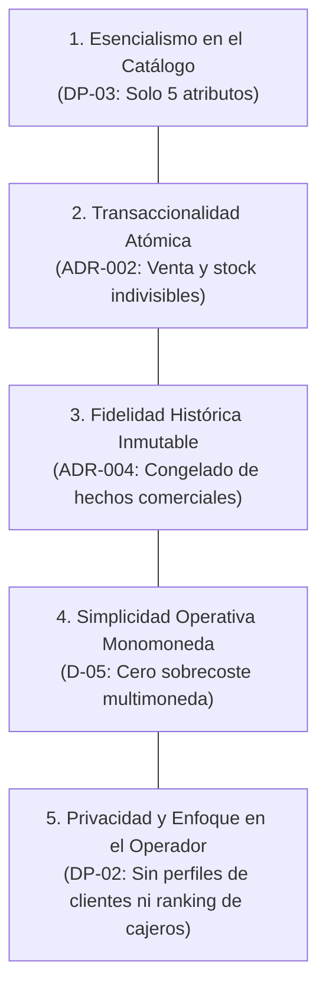

# 03 - Visión y Definición de Producto (Simple Stock Flow)

> **Documento SDD · Fase 3 (Reconstrucción Inversa)**  
> **Insumo:** `spec/data-model.md`  
> **Estado:** Definición de Problema, Visión y Principios de Producto derivados del Modelo de Datos  

---

## 1. Planteamiento del Problema (Problem Framing)

Los pequeños y medianos comercios minoristas (como ferreterías, depósitos y tiendas de suministros técnicos) se enfrentan comúnmente a dos extremos perjudiciales en la gestión de su negocio:

1. **Sistemas ERP excesivamente complejos:** Diseñados para corporaciones, cargados de jerarquías burocráticas, catálogos infinitos de atributos irrelevantes, tablas de conversión multimoneda y sobrecargas de configuración que entorpecen la agilidad del mostrador.
2. **Métodos manuales o herramientas precarias:** Libretas o planillas de cálculo sin garantías transaccionales, donde ocurren sobreventas de inventario que no existe, inconsistencias en precios cobrados y pérdida irreversible de los datos de ventas cuando se modifican los artículos.

### La brecha identificada
Existe una necesidad crítica de un sistema de punto de venta (POS) y control de flujo de stock que sea **minimalista, estricto y de alta confiabilidad transaccional**, donde la operación de caja tome segundos y los datos históricos permanezcan intactos frente al paso del tiempo.

---

## 2. Visión del Producto

> **"Proveer a los operadores comerciales de mostrador una plataforma ultraligera, atómica y a prueba de fallos para la facturación de ventas y control de inventario físico, eliminando cualquier complejidad accesoria que no aporte a la venta inmediata y a la estabilidad histórica de los números del negocio."**

---

## 3. Principios Fundamentales del Producto

Derivados de las decisiones estructurales del modelo de datos (`§1`, `§2`, `§7`, `§11.1`):

### 3.1 Esencialismo en el Catálogo (DP-03)
El producto adopta la regla **DP-03** (`§1`, `§2.2`, `§12`): un artículo del catálogo contiene únicamente:
- **Nombre**
- **Precio**
- **Stock**
- **Categoría**
- **Imagen (opcional)**

Se rechaza conscientemente la tentación de añadir SKUs secundarios, descripciones en prosa, códigos de barras alternativos o matrices de tallas/colores (`§1`, `DP-03`). Si un artículo necesita distinguirse, se refleja directamente en su nombre.

### 3.2 Transaccionalidad Atómica e Inventario Real
El stock físico no puede ser negativo bajo ninguna circunstancia (`ck_product_stock_non_negative`, `ADR-002`, `§2.2`). El sistema garantiza que una venta solo se confirma si hay existencias reales en bodega, resolviendo de forma transparente la concurrencia entre operadores sin bloquear la base de datos (`D-04`, `§3`).

### 3.3 Fidelidad Histórica y Reporte Inmutable
Una venta registrada es un hecho comercial consumado e inalterable (`§1`, `§2.3`, `§7.1`). El principio de **valores congelados** (`§1`, `§2.4`, `ADR-004`) garantiza que:
- Si el producto "Tornillo 2 pulgadas" sube de precio el mes entrante, los reportes y comprobantes de las ventas pasadas conservan el precio y nombre originales cobrados.
- El reporte agrupado por producto y categoría (`Q9`, `D-06`, `§11.1`, `H-1`) refleja fielmente los cortes contables sin que una reclasificación posterior reescriba el pasado.

### 3.4 Monomoneda por Diseño (D-05)
El sistema opera bajo una única divisa implícita del entorno comercial local (`D-05`, `§1`, `§3`). Se elimina toda complejidad de tasas de cambio, fluctuaciones cambiarias o tablas puente de divisas.

### 3.5 Enfoque en el Operador y Protección de la Privacidad (DP-02)
- **Sin entidad cliente:** El sistema no perfila clientes finales ni captura información personal de compradores (`§1`, `§7`, `§7.1`).
- **Sin competencia destructiva entre operadores:** La regla **DP-02** (`§6.3`, `§7`, `§12`) prohíbe el desglose de reportes de ventas por vendedor. La autoría de la venta (`sold_by`) se conserva únicamente por motivos de registro y control operativo, no para generar tableros de rendimiento personal.

---

## 4. Usuarios y Actores del Sistema

El modelo define un universo cerrado de dos roles para operadores internos autenticados (`§2.5`, `§3`):

| Rol | Actor de Negocio | Responsabilidades y Alcance en el Producto |
|---|---|---|
| `admin` | Administrador del Comercio / Dueño | • Da de alta, modifica y retira productos del catálogo (`HU-CAT-02`, `HU-CAT-03`). • Monitorea existencias de inventario (`HU-CAT-01`). • Consulta reportes periódicos consolidados de ventas (`HU-REP-01`, `Q9`). • Puede realizar ventas en mostrador (`HU-VTA-01`). • Da de alta operadores con rol `seller` (`DP-04`, `§11`). |
| `seller` | Vendedor de Mostrador / Cajero | • Busca productos disponibles en catálogo en tiempo real (`HU-CAT-01`). • Registra transacciones de venta con descuento automático de stock (`HU-VTA-01`). • Consulta comprobantes de ventas realizadas (`HU-VTA-02`). • No tiene acceso a reportes agregados ni a edición de catálogo. |

---

## 5. Decisiones de Producto Específicas (Trazadas al Modelo)

| Decisión | Enunciado en Modelo | Justificación de Negocio / Producto |
|---|---|---|
| **DP-01** | Manejo de nombres de producto en reportes históricos | Los nombres de producto en las líneas de venta quedan congelados en el instante de compra (`§2.4`). |
| **DP-02** | Reporte no desglosado por operador (`§6.3`, `§7`, `§12`) | El objetivo del reporte es el control de flujo de stock y volumen financiero del negocio, no la auditoría individualizante de empleados ni el cruce de datos personales. |
| **DP-03** | Atributos estrictos de `Product` (`§1`, `§2.2`, `§12`) | Mantener la interfaz de catálogo ágil, rápida de cargar en terminales ligeras y sin sobrecarga cognitiva para el vendedor. |
| **DP-04** | Creación restringida de administradores (`§9.2`, `§11.1 H-3`) | El rol `admin` no se crea dinámicamente en la aplicación para evitar vulnerabilidades de escalamiento de privilegios; se provisiona en el despliegue inicial. Los administradores solo crean vendedores. |
| **D-05** | Sistema Monomoneda (`§1`, `§3`, `§12`) | Simplifica la facturación, los reportes y los cálculos en moneda local sin riesgo de redondeos por arbitraje cambiario. |
| **D-06** | Reporte calculado directamente en el motor (`§1`, `Q9`, `ADR-004`) | Garantiza reportes instantáneos incluso con miles de líneas de venta históricas, sin sobrecargar la memoria de la aplicación. |
| **D-08** | Almacenamiento desacoplado de imágenes (`§1`, `§3`, `§7.1`) | La base de datos se mantiene ligera y compacta (solo guarda la clave `image_key`), acelerando las copias de seguridad y las consultas. |
| **D-10** | Categorías semilla fijas (`§2.1`, `§9.1`) | Evita la dispersión y desorden en el catálogo al mantener un conjunto fijo de 5 categorías estándar de ferretería/hogar. |

---

## 6. Lo que el Producto Expresamente NO es (Out of Scope de Producto)

Para mantener la propuesta de valor nítida y fiel a la especificación (`§12`):

1. **NO es un software de eCommerce B2C:** No gestiona carritos de compra persistentes, listas de deseos ni portales para usuarios anónimos de internet.
2. **NO es un procesador de pagos en línea:** No procesa pasarelas de pago ni almacena tarjetas de crédito (`§7`).
3. **NO es un gestor de relaciones con clientes (CRM):** No almacena fichas de clientes, historial de visitas ni campañas de marketing.
4. **NO es un ERP multisede ni multimoneda:** Opera sobre un inventario unificado y en moneda única.

---

## 7. Supuestos de Producto Declarados

| Identificador | Supuesto de Producto | Justificación |
|---|---|---|
| **SUP-PROD-01** | El negocio opera en una sola sede física o depósito compartido. | El modelo de datos vincula el stock directamente a la entidad `product` sin tablas de sucursales o almacenes múltiples. |
| **SUP-PROD-02** | El pago de la venta se asume completado en el mostrador antes o al momento de registrar la venta. | El modelo no incluye estados de pago (`pending`, `paid`, `cancelled`) ni cuentas por cobrar; la venta nace como hecho consumado e inmutable (`§1`, `§2.3`). |
