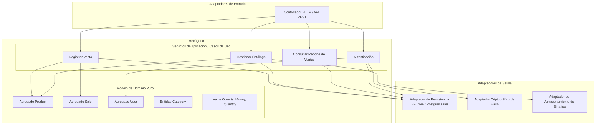
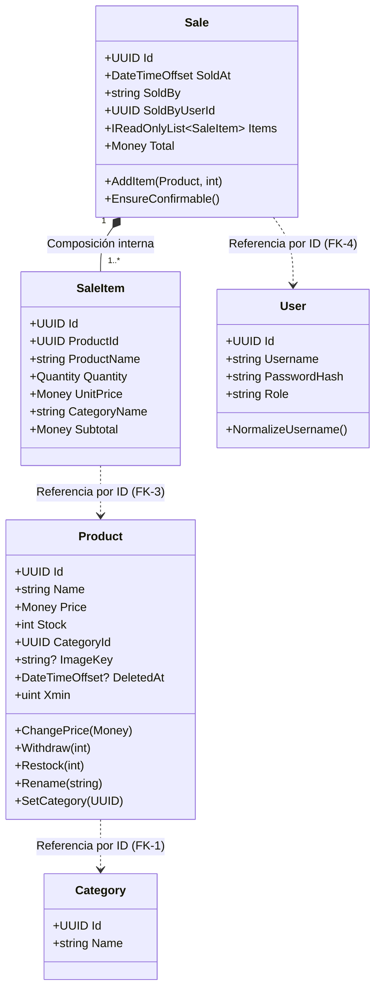
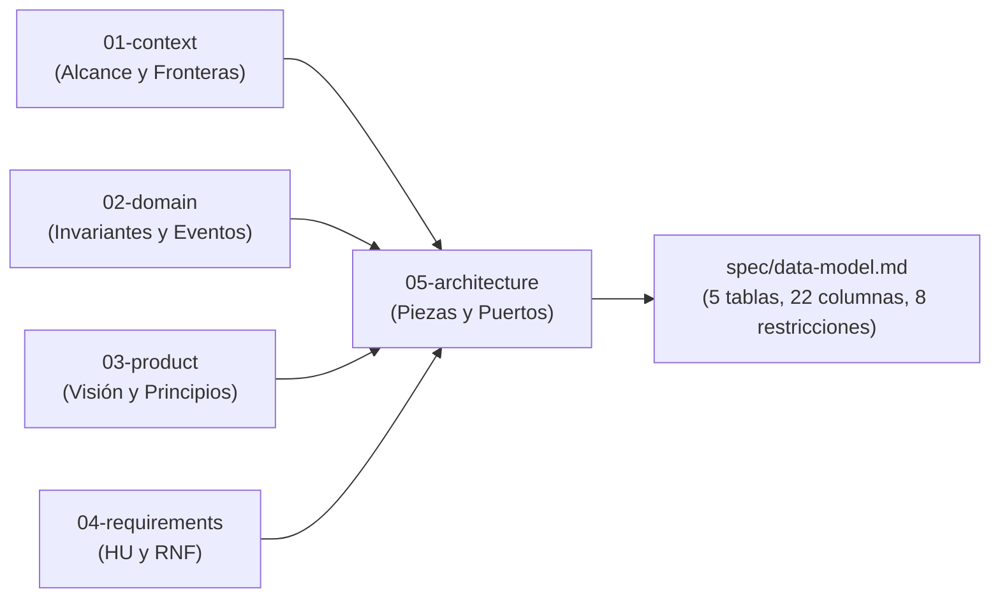

# 05 - Arquitectura del Sistema (Simple Stock Flow)

> **Documento SDD · Fase 1 (Reconstrucción Inversa)**  
> **Insumo:** `spec/data-model.md`  
> **Estado:** Especificación Arquitectónica derivada del Modelo de Datos  

---

## 1. Estilo Arquitectónico: Hexagonal (Puertos y Adaptadores)

A partir de las invariantes y restricciones del modelo de datos (`§2.5`, `§12`, `D-06`, `D-08`, `D-09`), el sistema implementa una **Arquitectura Hexagonal (Ports and Adapters)**.

### Justificación trazable al modelo de datos:
1. **Aislamiento del Dominio (`§2`, `§12`):** El dominio en C# define sus entidades y objetos de valor con independencia del almacenamiento. Las colecciones son en plural (`DbSet<Product> Products`, `Sale.Items`), mientras que el esquema físico mapea estrictamente a singular (`sales.product`, `sales.sale`) (`§0`).
2. **Puertos de Infraestructura desacoplados:**
   - **Criptografía (`§1`, `§2.5`, `D-09`):** El dominio nunca recibe ni conoce la contraseña en texto claro; solo opera sobre `user.password_hash` obtenido mediante un puerto de hashing (`IPasswordHasher`).
   - **Almacenamiento de Binarios (`§1`, `§3`, `§7.1`, `D-08`):** El modelo almacena únicamente `product.image_key` (una clave opaca de texto). El almacenamiento físico de imágenes reside fuera de la base de datos a través de un puerto (`IImageStorage`).
   - **Modelo de Lectura Optimizado (`§1`, `§6.1 Q9`, `D-06`, `ADR-004`):** El reporte de ventas agregado no pasa por el modelo de objetos transaccional de dominio; se resuelve en el motor de base de datos mediante un puerto de lectura especializado.

---

## 2. Límites de Agregados y Entidades del Dominio

El modelo físico de 5 tablas (`§2`, `§3`) delimita con exactitud las fronteras transaccionales y los agregados del sistema:

### 2.1 Agregado `Product` (Raíz de Agregado)
- **Propósito:** Control del catálogo y custodia del inventario (`§2.2`).
- **Raíz:** `Product`.
- **Invariantes del agregado:**
  - `stock >= 0` garantizado por el motor (`ck_product_stock_non_negative`, `ADR-002`) y el método `Product.Withdraw` (`§2.2`).
  - `price > 0` custodiado por el dominio en `Product.ChangePrice` (`§2.2`, `T-20`).
  - Redondeo financiero estricto a 2 decimales (`MidpointRounding.AwayFromZero`) en el Value Object `Money` (`§2.2`).
  - Baja lógica mediante propiedad sombra `deleted_at` (`T-09`, `ADR-003`).
  - Control de concurrencia optimista a través de la columna de sistema `xmin` (`§3`, `D-04`, `T-10`).

### 2.2 Agregado `Sale` (Raíz de Agregado)
- **Propósito:** Registro atómico e inmutable de transacciones comerciales (`§2.3`).
- **Raíz:** `Sale`.
- **Entidad Interna:** `SaleItem` (`§2.4`). `SaleItem` tiene visibilidad `internal`; no puede crearse de forma aislada sin la raíz (`§2.4`).
- **Invariantes del agregado:**
  - **Atomicidad de Venta y Stock (`§2.3`):** Añadir una línea de venta (`Sale.AddItem`) y descontar el stock (`Product.Withdraw`) constituyen **una sola operación indivisible**.
  - **Mínimo de líneas (`§2.3`):** Una venta exige al menos una línea para confirmarse (`Sale.EnsureConfirmable`).
  - **No duplicidad (`§2.3`, `T-20`):** Un mismo producto no se repite en una venta (`IX_sale_item_sale_id_product_id`).
  - **Congelamiento de Hechos Comerciales (`§1`, `§2.4`, `ADR-004`):** `SaleItem` almacena copias congeladas de `product_name`, `unit_price` y `category_name` (`T-11`) en el instante de la venta para desacoplar el histórico de futuras modificaciones en el catálogo.
  - **Inmutabilidad absoluta (`§1`, `§2.3`, `§7.1`):** No existen métodos de actualización ni borrado sobre ventas confirmadas.

### 2.3 Agregado `User` (Raíz de Agregado)
- **Propósito:** Gestión de identidad y credenciales de operadores internos (`§2.5`).
- **Raíz:** `User`.
- **Invariantes del agregado:**
  - Unicidad de `username` (`IX_user_username`, `§2.5`).
  - Normalización forzosa en minúsculas y sin espacios (`User.NormalizeUsername`, `§2.5`).
  - Conjunto cerrado de roles: `('admin', 'seller')` (`Roles.IsValid`, `§2.5`, `§3`).
  - Sin exposición de clave en texto plano (`D-09`).

### 2.4 `Category` (Entidad de Referencia de Solo Lectura)
- **Propósito:** Clasificación fija de productos (`§2.1`).
- **Naturaleza:** No es raíz de agregado ni tiene ciclo de vida modificable (`§2.1`, `D-10`).
- **Comportamiento:** Su repositorio es de **solo lectura**. Las 5 categorías provienen exclusivamente de la semilla inicial de migración (`§9.1`).

---

## 3. Puertos del Sistema (Inbound y Outbound)

Derivados de los patrones de acceso reales identificados en `§6.1` (Q1 a Q10):

### 3.1 Puertos de Entrada (Casos de Uso / Inbound Ports)

| Puerto de Entrada | Patrón (`§6.1`) | Operación del Caso de Uso | Reglas asociadas |
|---|---|---|---|
| `ISearchProductsUseCase` | Q1 | Consulta paginada por texto parcial, categoría y activos | Índice trigramas/parcial (`§6.2`, `T-13`). |
| `IGetProductByIdUseCase` | Q2 | Consulta individual de producto | Excluye bajas lógicas (`T-09`). |
| `IManageProductUseCase` | Q3 | Crear producto, actualizar precio, stock y baja lógica | Concurrencia `xmin` (`D-04`), stock no negativo (`ck_product_stock_non_negative`). |
| `IListCategoriesUseCase` | Q4, Q5 | Listado y consulta de categorías | Repositorio solo lectura (`§2.1`, `D-10`). |
| `IRegisterSaleUseCase` | Q3, Q6 | Registro atómico de venta con descuento de inventario | Descuento atómico (`§2.3`), inmutabilidad (`§7.1`), congelamiento (`§2.4`). |
| `IGetSaleByIdUseCase` | Q6 | Consulta de comprobante de venta con sus líneas | Recupera datos congelados (`§2.4`). |
| `IListSalesByDateRangeUseCase` | Q7 | Consulta paginada de ventas ordenadas por fecha descendente | Uso de `IX_sale_sold_at` (`§6.2`). |
| `IGetSalesReportUseCase` | Q9 | Reporte agrupado por producto y categoría en rango temporal | Agrupación directa en base de datos (`D-06`, `ADR-004`, `§11.1`). |
| `IAuthenticateUserUseCase` | Q10 | Validación de credenciales de operador | Normalización (`User.NormalizeUsername`), verificación de hash (`§2.5`). |
| `IRegisterSellerUseCase` [Supuesto] | Q10 | Alta de operadores con rol `seller` por parte de un administrador | Autorización restringida a administradores (`DP-04`, `§11`). |

### 3.2 Puertos de Salida (Infraestructura / Outbound Ports)

| Puerto de Salida | Adaptador Destino | Responsabilidad |
|---|---|---|
| `IProductRepository` | `SalesDbContext` (EF Core / Postgres) | Persistencia de productos, control de bajas lógicas y concurrencia optimista (`§2.2`). |
| `ISaleRepository` | `SalesDbContext` (EF Core / Postgres) | Inserción de venta y cascada de `sale_item` (`FK-2`, `§2.3`). |
| `ICategoryReadOnlyRepository` | `SalesDbContext` (EF Core / Postgres) | Consulta de categorías sembradas (`§2.1`, `§9.1`). |
| `IUserRepository` | `SalesDbContext` (EF Core / Postgres) | Búsqueda por `username` e inserción de operadores (`§2.5`). |
| `ISalesReportQuery` | Consulta SQL nativa / Dapper en `sales` | Ejecución optimizada de agregación (`Q9`, `D-06`, `ADR-004`). |
| `IPasswordHasher` | Servicio Criptográfico (BCrypt / Argon2 [Supuesto]) | Creación y verificación de huella de clave (`§1`, `D-09`). |
| `IImageStorage` | Almacenamiento externo de blobs / S3 [Supuesto] | Carga y eliminación física de binarios de imagen mediante `image_key` (`§1`, `D-08`, `§7.1`). |

---

## 4. Dónde vive cada regla: Matriz de Responsabilidad

El diseño establece explícitamente qué capa y motor custodia cada invariante (`§4`, `§5`):

| Invariante / Regla | Dónde vive hoy | Custodio Arquitectónico | Justificación y Trazabilidad |
|---|---|---|---|
| Claves Primarias UUID | **Motor** | `PK_*` en Postgres | Identidad inmutable generada por la aplicación (`§3`, `§5`). |
| Unicidad `category.name` | **Motor** | `IX_category_name` | Índice único (`§4`). |
| Unicidad `user.username` | **Motor** | `IX_user_username` | Índice único (`§4`). |
| Normalización de `username` | **Solo Dominio** | `User.NormalizeUsername` | Minúsculas y trim antes de persistir (`§2.5`, deuda `T-20`). |
| `product.stock >= 0` | **Motor** y **Dominio** | `ck_product_stock_non_negative` / `Product.Withdraw` | Defensa en profundidad (`ADR-002`, `§2.2`, `§4`). |
| Retiro de stock sin exceder disponible | **Solo Dominio** | `Product.Withdraw` | Regla de proceso no representable en CHECK estático (`§2.2`). |
| `product.price > 0` | **Solo Dominio** | `Product.ChangePrice` | Value Object `Money` (`§2.2`, deuda `T-20`). |
| Redondeo financiero a 2 decimales | **Solo Dominio** | Value Object `Money` | `MidpointRounding.AwayFromZero` sincronizado con `numeric(18,2)` (`§2.2`). |
| Categoría obligatoria en producto | **Motor** | `FK_product_category_category_id` (RESTRICT) | Integridad referencial FK-1 (`§5`). |
| Normalización `image_key` (blanco a null) | **Solo Dominio** | `Product.AttachImage` | El motor solo admite `NULL` o valor (`§2.2`). |
| Baja lógica en productos | **Motor** y **Dominio** | Columna sombra `deleted_at` + Filtro Global EF Core | Impide borrado físico accidental (`ADR-003`, `T-09`). |
| Venta con al menos una línea | **Solo Dominio** | `Sale.EnsureConfirmable` | Exigiría trigger diferido en base de datos (`§2.3`). |
| No repetir producto en la misma venta | **Motor** y **Dominio** | `IX_sale_item_sale_id_product_id` / `Sale.AddItem` | Índice único compuesto con columnas incluidas (`§2.3`, `T-20`). |
| Descuento de stock atómico con adición de línea | **Solo Dominio** | `Sale.AddItem` + Transacción de Aplicación | Orquestación transaccional de agregados (`§2.3`). |
| Integridad de línea de venta a venta | **Motor** | `FK_sale_item_sale_sale_id` (CASCADE) | Composición pura de agregados (`§5`, FK-2). |
| Bloqueo de borrado de producto vendido | **Motor** | `FK_sale_item_product_product_id` (RESTRICT) | Barrera de última instancia contra borrado físico (`§5`, FK-3, `T-20`). |
| Atribución obligatoria de venta a usuario | **Motor** y **Dominio** | `FK_sale_sold_by_user_id` (RESTRICT) [Pendiente] | T-12 (`§3`, `§5`, FK-4). |
| Inmutabilidad de la venta | **Solo Dominio** | Ausencia intencional de puertos de edición/borrado | Garantía de registro contable inmutable (`§2.3`, `§7.1`). |
| Conjunto cerrado de roles `admin`/`seller` | **Solo Dominio** | `Roles.IsValid` | Validación en dominio (`§2.5`, deuda `T-20`). |
| Password nunca en claro | **Arquitectura / Dominio** | Puerto `IPasswordHasher` | Diseño de fronteras del hexágono (`D-09`). |

---

## 5. Estrategia de Concurrencia y Transaccionalidad

1. **Concurrencia Optimista en Catálogo (`§3`, `D-04`, `T-10`):**  
   Para resolver la contención en actualizaciones de stock durante ventas concurrentes (`Q3`), el agregado `Product` utiliza la columna de sistema `xmin` de PostgreSQL como propiedad sombra mapeada por EF Core. Si dos transacciones intentan descontar stock simultáneamente sobre el mismo producto, la segunda transacción detecta el conflicto de concurrencia y falla de manera limpia sin corromper el saldo.
2. **Atomicidad Transaccional (`§2.3`, `ADR-002`):**  
   El caso de uso `RegisterSale` envuelve el decremento de existencias de todos los productos y la creación del registro `sale` con sus `sale_item` en una **única transacción de base de datos** bajo nivel de aislamiento estándar en PostgreSQL (`Read Committed`).
3. **Consistencia Eventual en Borrado de Binarios (`§7.1`, `D-08`):**  
   Dado que el almacenamiento de imágenes externo no participa en la transacción ACID de PostgreSQL, la secuencia de reemplazo/eliminación es estricta:
   - **Paso 1:** Se actualiza `image_key = NULL` en la base de datos y se hace commit.
   - **Paso 2:** Se solicita la eliminación física del binario en el puerto `IImageStorage`.  
   Esto evita imágenes rotas en caso de caída del sistema (`§7.1`).

---

## 6. Supuestos Arquitectónicos Declarados

| Identificador | Supuesto Arquitectónico | Justificación técnica |
|---|---|---|
| **SUP-ARQ-01** | La API HTTP expone controladores REST sincrónicos con respuestas JSON estándar. | El modelo define contratos y esquemas transaccionales compatibles con microservicios o monolitos modulares en .NET Core / C#. |
| **SUP-ARQ-02** | El almacenamiento de imágenes utiliza un proveedor compatible con claves opacas S3/Blob Storage. | El modelo declara expresamente que `image_key` es una clave opaca (`varchar(512)`) y no almacena rutas locales ni bytes (`D-08`). |
| **SUP-ARQ-03** | El control de transacciones de aplicación se delega a la unidad de trabajo (`DbContext.SaveChangesAsync`) de EF Core. | Consistente con el uso de migraciones de EF Core (`ADR-001`) y el mapeo de propiedades sombra. |

---

## 7. Cierre Arquitectónico: Comprobación de Consistencia Integral (Verification Loop)

Siguiendo el flujo del reto SDD, se cierra el ciclo verificando que la arquitectura del sistema ensamble armónicamente con cada uno de los documentos reconstruidos hacia atrás y con el modelo de datos físico (`spec/data-model.md`):

### 7.1 Matriz de Alineación de Consistencia Integral

| Dimensión Reconstruida | Compromiso en la Documentación | Reflejo Exacto en la Arquitectura y Motor | Estado de Validación |
|---|---|---|---|
| **Contexto (`01-context`)** | Ausencia absoluta de clientes/compradores y pasarelas de pago (`§1`, `§7`). | No existen agregados ni tablas de clientes; la venta registra únicamente la autoría del operador (`sold_by`) (`§3`). | **Cuadra al 100%** |
| **Contexto (`01-context`)** | Cierre de auditoría genérica `created_at` / `updated_at` (`§8`). | La arquitectura no implementa triggers ni propiedades sombra de auditoría; solo existen `sale.sold_at` y `product.deleted_at` (`§3`, `§8`). | **Cuadra al 100%** |
| **Dominio (`02-domain`)** | Valores congelados en líneas de venta (`§1`, `§2.4`, `ADR-004`). | Entidad `SaleItem` clona `product_name`, `unit_price` y `category_name` en columnas físicas de base de datos (`§3`, `T-11`). | **Cuadra al 100%** |
| **Dominio (`02-domain`)** | Restricción inquebrantable de stock no negativo (`ADR-002`). | Custodiada simultáneamente por el método `Product.Withdraw` en C# y `ck_product_stock_non_negative` en Postgres (`§4`). | **Cuadra al 100%** |
| **Producto (`03-product`)** | Esencialismo en catálogo: solo 5 atributos (`DP-03`). | Tabla `product` contiene exactamente `id`, `name`, `price`, `stock`, `category_id`, `image_key` (y técnica `deleted_at`) (`§3`). | **Cuadra al 100%** |
| **Producto (`03-product`)** | Protección de datos del operador y no ranking (`DP-02`). | No existe índice sobre `sold_by_user_id` ni puerto de consulta de ventas desglosadas por vendedor (`§6.3`). | **Cuadra al 100%** |
| **Producto (`03-product`)** | Estabilidad histórica de reportes ante recategorización (`§11.1`, `H-1`). | El puerto de lectura `ISalesReportQuery` agrupa por `category_name` congelado en motor (`Q9`, `D-06`). | **Cuadra al 100%** |
| **Requisitos (`04-requirements`)** | Atomicidad en registro de ventas con inventario (`HU-VTA-01`, `RNF-01`). | Caso de uso `RegisterSale` coordina `Sale` y `Product` en una sola transacción ACID de PostgreSQL (`§2.3`). | **Cuadra al 100%** |
| **Requisitos (`04-requirements`)** | Rendimiento y concurrencia optimista (`RNF-02`, `RNF-07`). | Implementación de `xmin` para evitar contención pesimista e índice cubridor en `sale_item` (`§3`, `§6.2`, `T-13`). | **Cuadra al 100%** |
| **Modelo Físico (`spec/data-model.md`)** | 5 tablas en singular, 22 columnas físicas, 8 restricciones y 12 índices. | Toda la arquitectura mapea al esquema `sales`, sin tablas puente sobrantes ni dependencias fantasma (`§0`, `§10`). | **Cuadra al 100%** |

### 7.2 Veredicto de Cierre
La arquitectura hexagonal y los patrones diseñados satisfacen con rigor matemático todas las invariantes y decisiones registradas en `spec/data-model.md`, sin inventar requerimientos innecesarios y garantizando trazabilidad total de extremo a extremo.

